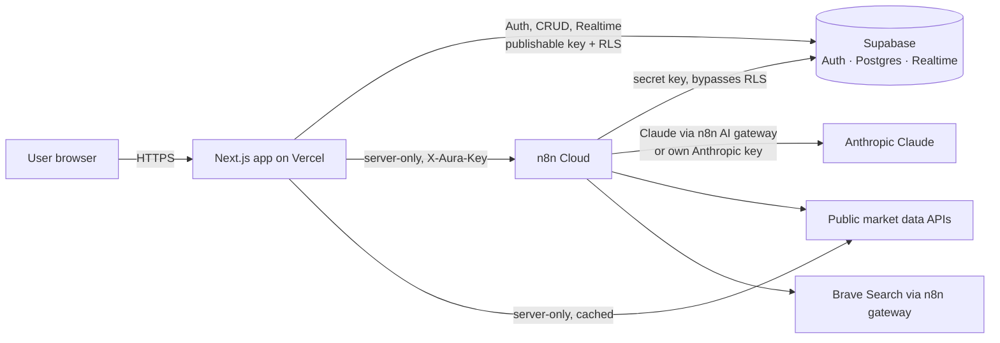
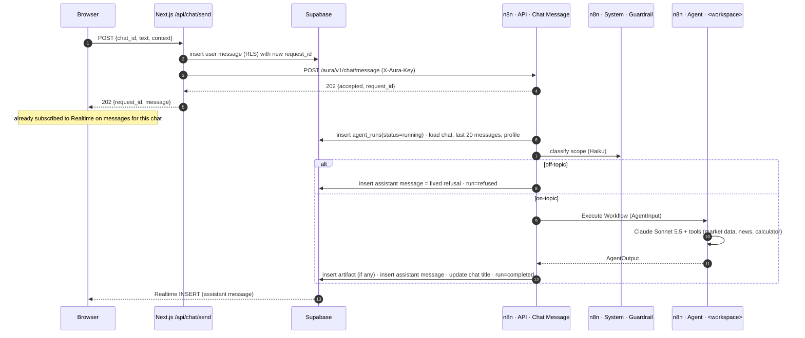
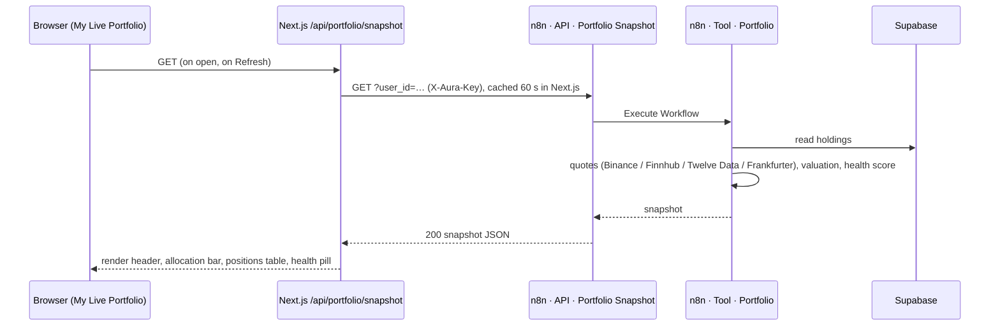

# 02. Architecture

## 1. Goals and constraints

| Goal / constraint | Consequence |
|---|---|
| Agents and automation run in **n8n** | All agent logic, tools, schedules and orchestration are n8n workflows on n8n Cloud |
| **Always working** | Published (active) workflows on a paid n8n plan, no local machines, provider fallbacks, idempotent writes, monitoring |
| Custom branded web UI (Claude-like) | Next.js on Vercel; n8n is never exposed to the browser |
| Low cost for one user, room for a SaaS later | Free data tiers now; per-user isolation (RLS), usage metering and swappable providers from day one |
| English everywhere | UI copy, prompts and replies are English |
| Parallel development by several AI sessions | Frozen contracts, clear ownership, repo as source of truth |

## 2. System context



| Component | Responsibility | Owner session |
|---|---|---|
| **Web app** (`apps/web`, Next.js on Vercel) | All UI, auth session, chat CRUD through Supabase, sending messages through `/api/chat/send`, Realtime subscriptions, charts, live portfolio panel, market ticker. Server route handlers for market data that the UI shows (no n8n quota use) | Web App |
| **Supabase** | System of record: users and profiles, chats, messages, agent runs, holdings, snapshots, artifacts, cache. Auth (email), RLS, Realtime | Platform & Main (schema), everyone reads |
| **n8n: API workflows** | Webhook entry points: `chat/message` (gateway), `portfolio/snapshot` | Platform & Main (gateway), Portfolio (snapshot) |
| **n8n: Agent workflows** | One per workspace: AI Agent node with Claude, tools, structured output | One agent session each |
| **n8n: Tool workflows** | Sub-workflows that fetch and condense market data for agents | The owning agent session |
| **n8n: Jobs** | Scheduled automation (daily portfolio review, later alerts) | Portfolio (daily review) |
| **n8n: System** | Guardrail classifier, error handler | Platform & Main |
| **Claude models** | Reasoning and writing. Sonnet 5.5 for agents, Haiku 4.5 for guardrail and titles | via n8n |
| **Data providers** | Binance, Bybit, Twelve Data, Finnhub, SEC EDGAR, FRED, CoinGecko, DefiLlama, alternative.me, Frankfurter, RSS, Brave Search | see [04-data-sources.md](04-data-sources.md) |

## 3. Key flows

### 3.1 Send a message (asynchronous, the core flow)



Why asynchronous:

- An agent turn with tools takes 10–90 s. That is longer than is comfortable for synchronous HTTP through Vercel functions and webhooks.
- Realtime delivery also survives page reloads: the reply simply appears in the chat when it is written.

Failure handling:

- The agent's Execute Workflow node uses its error output. On failure the gateway writes an assistant message with `status = 'error'` and a friendly text, and sets the run to `failed`.
- `Aura · System · Error Handler` (Error Trigger) catches unexpected workflow crashes and alerts the owner.
- If the Next.js call to n8n fails, the API returns `502 AGENT_UNAVAILABLE`. The UI marks the message "Not delivered" with a **Retry** button that re-sends the same `request_id`.

Idempotency: `request_id` is unique on `agent_runs` and on assistant messages. A retried request that was already processed is acknowledged and not run twice.

### 3.2 Market data shown in the UI (no n8n)

The ticker strip and candle charts are fetched by **Next.js route handlers** directly from providers, with server-side caching (`/api/market/overview`, `/api/market/candles`). This keeps n8n execution quota for agent work: on n8n Cloud every webhook call is a billed execution. Endpoint and symbol mapping rules are shared with the agent tools and documented in [04-data-sources.md](04-data-sources.md).

### 3.3 Pinned live portfolio



**Run review** in the pinned chat sends a normal chat message with `mode = 'portfolio_review'` through flow 3.1.

### 3.4 Daily portfolio review (automation)

`Aura · Job · Daily Portfolio Review` runs on a schedule (06:30 UTC). For each user with holdings it:

1. calls `Aura · Tool · Portfolio`;
2. stores a `portfolio_snapshots` row;
3. runs the Portfolio agent in `mode = 'daily_review'`;
4. inserts the brief as an assistant message into the pinned chat;
5. logs an `agent_runs` row.

The UI receives it over Realtime, or on next load. A side benefit: this daily database activity keeps a free Supabase project from auto-pausing.

## 4. Agent runtime design

### 4.1 Routing

Routing is **deterministic by workspace**. The user chooses the workspace, the chat stores it, and the gateway routes on `chats.workspace`. There is no LLM router between agents. When a question fits another workspace better, the agent answers briefly and returns `suggested_workspace`. The UI then shows an "Open in Horizon 2030" chip. This makes behaviour predictable and costs nothing extra.

### 4.2 Agent workflow anatomy (identical for all four agents)

```
Execute Workflow Trigger (AgentInput)
  → Code "Build prompt"        formats session block, history, message (see 08-agents.md)
  → AI Agent                   system prompt = agents/<id>/system-prompt.md (static, cacheable)
       ├─ Anthropic Chat Model claude-sonnet-5-5, max tokens 4096, prompt caching 5m
       ├─ Tools                toolWorkflow nodes → Aura · Tool · *  +  Brave Search tool  +  Calculator
       └─ Structured Output Parser (AgentOutput schema)
  → Code "Normalize output"    defaults, sources, model, usage → AgentOutput
```

### 4.3 Memory

Conversation memory is **the `messages` table**. The gateway loads the last 20 messages (oldest first, truncated to about 12k tokens) and passes them in `history`. We do not use n8n memory nodes:

- one source of truth;
- deleting a chat deletes its memory;
- no duplicate storage.

The Portfolio agent also gets live holdings through its tool. It does not rely on memory for them.

### 4.4 Tools

Tools are n8n sub-workflows (`Aura · Tool · *`) wired to agents with the "Call n8n Workflow Tool" node, or plain tool nodes (Brave Search, Calculator). Tool rules:

- return compact JSON (≤ 6k tokens), with indicators and levels computed in Code nodes, never raw dumps;
- include `source` and `as_of`;
- use `market_cache` for slow-changing data;
- fail soft by returning `{ "error": { "code", "message" } }` instead of throwing, so the agent can say what is missing.

Sub-workflow executions do not count towards the n8n Cloud execution quota.

### 4.5 Models

| Use | Model | Settings |
|---|---|---|
| Main, Trading, Horizon, Portfolio agents | `claude-sonnet-5-5` | max tokens 4096; thinking off (adaptive `low` allowed for Horizon theses); prompt caching `5m` |
| Guardrail classifier, chat title fallback | `claude-haiku-4-5` | max tokens 200 |
| Optional deep-dive artifacts (Elite tier) | `claude-opus-5-5` | adaptive thinking `medium` |

Credentials: n8n AI gateway credits (no own key) for the MVP. Switch to an own `anthropicApi` credential named "Aura Anthropic" when usage grows. See [10-operations.md](10-operations.md).

## 5. Security

| Area | Measure |
|---|---|
| Browser → data | Supabase publishable key plus **RLS on every table**. Users can only read and write their own rows. Users can insert only `role = 'user'` messages and cannot edit or delete messages |
| Browser → n8n | Never direct. Only Next.js server routes call n8n, with the `X-Aura-Key` header (n8n Header Auth credential "Aura Webhook Key") |
| n8n → Supabase | Secret / service-role key stored only in the n8n credential "Aura Supabase" |
| Gateway trust | The gateway re-reads the user message from the database by `message_id` and checks `chat_id` and `user_id` match. It never trusts payload text alone |
| Prompt injection | Tool outputs (news, filings, web pages) are untrusted data. Every system prompt says so. Agents have no write tools except artifacts through the gateway; holdings are read-only to agents |
| Secrets | Never in the repo. `.env.example` lists names only |
| Accounts | Sign-ups disabled in Supabase Auth; the owner invites users |
| PII | Only email, display name, holdings. EU (Frankfurt) Supabase region recommended. Account deletion cascades |
| Trading safety | No exchange trading keys anywhere. Aura cannot place orders |

## 6. Reliability ("always working")

| Risk | Measure |
|---|---|
| n8n plan expiry or inactive workflows | Paid n8n Cloud plan; all API, agent, tool and job workflows **published**; a weekly check in [10-operations.md](10-operations.md) |
| Provider error, 429 or geo-block (HTTP 451) | HTTP nodes: timeout 15 s, retry 2× with 2 s wait. Fallback hosts per provider ([04-data-sources.md](04-data-sources.md)). Agents degrade gracefully |
| Slow agent | `maxIterations` 8; tool timeouts. Gateway marks the run failed after 150 s and writes an error message; the UI shows Retry |
| Duplicate processing | `request_id` unique constraints; the gateway checks for an existing run first |
| Supabase free tier auto-pause | Daily job activity; upgrade to Pro for Phase B |
| Silent failures | `agent_runs` table plus Error Handler alerts. Monitoring queries in [10-operations.md](10-operations.md) |
| Vercel region vs Binance geo-blocking | Market routes use `data-api.binance.vision` and `preferredRegion = 'fra1'` |

Performance targets: P50 agent reply < 25 s, P95 < 60 s. UI interactions < 100 ms. Chart render < 1.5 s.

Capacity: n8n Cloud Starter allows 5 parallel executions and Pro allows 20, which is plenty for Phase A/B.

## 7. Environments

| Environment | Web | Database | n8n |
|---|---|---|---|
| Production | Vercel production (`main` branch) | Supabase project `aura-prod` (EU) | n8n Cloud project, workflows tagged `aura` |
| Preview | Vercel preview per PR | same Supabase project (MVP) | same n8n (MVP) |
| Local | `apps/web` on localhost | same Supabase project | same n8n |

A separate staging stack is a Phase B item. Until then, risky n8n changes are made on a copy of the workflow (`… [draft]`) and swapped in once tested.

## 8. Architecture decision records

| ID | Decision | Why | Revisit when |
|---|---|---|---|
| ADR-001 | Agents are **n8n workflows with AI Agent nodes**, not first-class n8n Agents | First-class n8n Agents can only be reached through Slack, Telegram, Discord or Linear integrations and Preview. The "Message an Agent" node is retired. Our custom web UI needs a webhook entry point | n8n adds an HTTP/webhook way to invoke Agents. A Telegram alerts Agent is a candidate for Phase B |
| ADR-002 | **Supabase** is the system of record (not n8n Data Tables) | Auth, RLS, Realtime and SQL in one service; needed for multi-user SaaS | — |
| ADR-003 | **Async** request/response with Realtime delivery | Agent runs exceed comfortable HTTP timeouts; resilient to reloads | Streaming tokens becomes a requirement |
| ADR-004 | Only **Next.js server routes** call n8n | Keeps the webhook key server-side; one place for auth checks | — |
| ADR-005 | **Deterministic workspace routing** plus `suggested_workspace` | Predictable, cheap, clear mental model | — |
| ADR-006 | UI market data goes **directly from Next.js** to providers | Each n8n webhook call is a billed execution; the UI polls more than agents do | — |
| ADR-007 | **Free/no-key data first**, behind tool interfaces | Zero data cost in Phase A; providers swappable per tool | Phase C commercial licences |
| ADR-008 | **Repo is the source of truth** for prompts and workflow code (n8n Workflow SDK files) | Reviewable diffs, rebuildable n8n, parallel sessions | — |
| ADR-009 | History from `messages`, **no n8n memory nodes** | Single source of truth, deletion semantics, prompt control | — |
| ADR-010 | Claude **Sonnet 5.5** for agents, **Haiku 4.5** for guardrail | Best cost/quality for tool use; Haiku is cheap and fast for classification | New model generations |

## 9. Technology choices

| Layer | Choice |
|---|---|
| Web framework | Next.js (latest stable, App Router, TypeScript, React Server Components where useful) |
| Styling | Tailwind CSS v4 with CSS-variable tokens from [03-design-system.md](03-design-system.md); shadcn/ui primitives restyled flat |
| Icons | `lucide-react`, plus a custom SVG logo mark |
| Charts | `lightweight-charts` (TradingView, Apache-2.0) for candles; plain SVG for allocation bars and sparklines |
| Markdown | `react-markdown` + `remark-gfm` |
| Supabase client | `@supabase/supabase-js` + `@supabase/ssr` |
| Hosting | Vercel (functions in `fra1` for market routes) |
| Orchestration | n8n Cloud (Workflow SDK through the n8n MCP server for building) |
| Database | Supabase Postgres (EU region), Realtime |
| LLM | Anthropic Claude via the n8n Anthropic Chat Model node |
