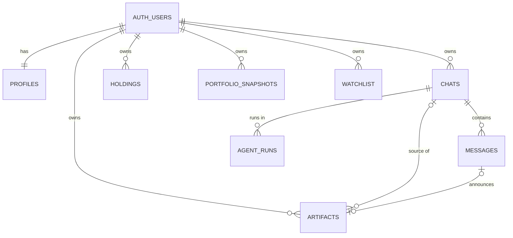

# 06. Database (Supabase Postgres)

> **Frozen contract.** The schema is defined only by migrations in [`supabase/migrations/`](../supabase/migrations/). Never edit an applied migration. Add a new timestamped file and log the change in [CHANGELOG.md](CHANGELOG.md).
> The first migration is [`20261007000000_init.sql`](../supabase/migrations/20261007000000_init.sql).

## 1. Entity overview



`market_cache` stands alone and is written only by n8n.

## 2. Enums

| Enum | Values |
|---|---|
| `workspace` | `main`, `trading`, `horizon`, `portfolio` |
| `asset_class` | `crypto`, `stock`, `etf`, `index`, `gold`, `cash` |
| `chat_kind` | `standard`, `portfolio_live` |
| `message_role` | `user`, `assistant` |
| `message_status` | `complete`, `error` |
| `run_status` | `queued`, `running`, `completed`, `refused`, `failed` |
| `risk_profile` | `conservative`, `balanced`, `aggressive` |
| `artifact_kind` | `report`, `thesis`, `portfolio_review`, `note` |

## 3. Tables

### `profiles`: one row per user, created by trigger on sign-up

| Column | Type | Notes |
|---|---|---|
| `id` | uuid PK → `auth.users.id` | |
| `display_name` | text | Defaults to the email local part |
| `avatar_url` | text null | |
| `base_currency` | text | `USD` default; ISO 4217 |
| `risk_profile` | `risk_profile` | `balanced` default |
| `timezone` | text | IANA name, `UTC` default |
| `plan` | text | `pro` default; not user-editable |
| `monthly_reply_cap` | int null | null = unlimited (Phase A) |
| `created_at`, `updated_at` | timestamptz | |

### `chats`

| Column | Type | Notes |
|---|---|---|
| `id` | uuid PK | |
| `user_id` | uuid → `auth.users` | |
| `workspace` | `workspace` | Immutable in practice |
| `kind` | `chat_kind` | `portfolio_live` = the pinned chat (one per user, only in `portfolio`) |
| `title` | text | `New chat` until the first reply sets it |
| `is_pinned` | bool | true for `portfolio_live` |
| `asset_class`, `symbol`, `timeframe` | saved composer context | |
| `archived_at` | timestamptz null | Hidden from the sidebar when set |
| `last_message_at` | timestamptz null | Maintained by trigger |
| `created_at`, `updated_at` | timestamptz | |

### `messages`

| Column | Type | Notes |
|---|---|---|
| `id` | uuid PK | |
| `chat_id` | uuid → `chats` (cascade) | |
| `user_id` | uuid → `auth.users` | Equals the chat owner |
| `role` | `message_role` | |
| `status` | `message_status` | `error` only for assistant failures |
| `content` | text | Markdown, ≤ 50,000 chars |
| `request_id` | uuid null | Unique per role. Links a user message to its assistant reply |
| `context` | jsonb | User messages: `{ asset_class, symbol, timeframe, mode }` |
| `metadata` | jsonb | Assistant messages: `AssistantMetadata` ([05-api-contracts.md](05-api-contracts.md)) |
| `created_at` | timestamptz | |

### `agent_runs`: one row per processed request (observability, metering, idempotency)

| Column | Type | Notes |
|---|---|---|
| `id` | uuid PK | |
| `request_id` | uuid **unique** | Idempotency key |
| `user_id`, `chat_id` | uuid | |
| `workspace` | `workspace` | |
| `mode` | text | `chat`, `portfolio_review`, `daily_review` |
| `status` | `run_status` | |
| `model` | text null | |
| `input_tokens`, `output_tokens` | int null | Best effort |
| `cost_usd` | numeric null | Computed by the gateway from the model price table |
| `latency_ms` | int null | |
| `error_code`, `error_message` | text null | |
| `n8n_execution_id` | text null | For debugging in the n8n UI |
| `started_at`, `finished_at` | timestamptz | |

### `holdings`: the user's positions, entered manually in the MVP

| Column | Type | Notes |
|---|---|---|
| `id` | uuid PK | |
| `user_id` | uuid | |
| `asset_class` | `asset_class` | Any value except `index`, which is not holdable; use an ETF instead |
| `symbol` | text | Crypto **base asset** (`BTC`), stock or ETF ticker (`NVDA`), `XAU` for gold (troy ounces), ISO code for cash (`USD`) |
| `display_name` | text null | |
| `quantity` | numeric(38,18) | ≥ 0 |
| `avg_cost` | numeric null | Per unit, in `cost_currency` |
| `cost_currency` | text | `USD` default |
| `venue` | text null | Free text: "Binance", "IBKR", "Ledger" |
| `notes` | text null | |
| `created_at`, `updated_at` | timestamptz | Unique `(user_id, asset_class, symbol, venue)` with nulls not distinct |

### `portfolio_snapshots`: written by n8n (daily job and on-demand reviews)

Columns: `id`, `user_id`, `as_of`, `base_currency`, `total_value`, `total_cost`, `allocation` jsonb, `positions` jsonb, `health_score` smallint, `health` jsonb, `macro_regime` text, `summary_md` text, `source` (`daily_review` | `on_demand`).

### `artifacts`: long-form outputs listed under Artifacts

Columns: `id`, `user_id`, `chat_id` (set null on delete), `message_id` (set null), `workspace`, `kind`, `title`, `content_md`, `created_at`.

### `watchlist` (Phase B, created now to avoid a later migration)

Columns: `id`, `user_id`, `asset_class`, `symbol`, `created_at`. Unique `(user_id, asset_class, symbol)`.

### `market_cache`: n8n read-through cache

Columns: `key` text PK, `payload` jsonb, `fetched_at`, `expires_at`. There is no user access; RLS is on and there are no policies.

### View `monthly_usage` (security invoker)

`user_id`, `month`, `replies` (completed runs), `refusals`, `failures`, `cost_usd`. The gateway uses it for the monthly cap.

## 4. Row-level security matrix

`auth.uid()` is the signed-in user. n8n uses the secret / service-role key, which **bypasses RLS**.

| Table | Browser (authenticated) | n8n (service) |
|---|---|---|
| `profiles` | select own; update own (`display_name`, `avatar_url`, `base_currency`, `risk_profile`, `timezone` only) | read |
| `chats` | select own; insert own (`kind = 'standard'`); update own `standard` chats (`title`, `is_pinned`, `archived_at`, `asset_class`, `symbol`, `timeframe` only); delete own `standard` chats. The pinned `portfolio_live` chat is read-only | read; update `title` |
| `messages` | select own; insert **only** `role = 'user'`, `status = 'complete'` into own chats; no update or delete | insert assistant messages; read history |
| `agent_runs` | select own | insert / update |
| `holdings` | full CRUD on own rows | read |
| `portfolio_snapshots` | select own | insert |
| `artifacts` | select own; delete own | insert |
| `watchlist` | full CRUD on own rows | read |
| `market_cache` | none | read / write |

## 5. Triggers and automation in the database

| Trigger | Effect |
|---|---|
| `on_auth_user_created` (after insert on `auth.users`) | Creates the `profiles` row and the pinned chat `My Live Portfolio` (`workspace = 'portfolio'`, `kind = 'portfolio_live'`, `is_pinned = true`) |
| `messages_touch_chat` (after insert on `messages`) | Sets `chats.last_message_at` and `updated_at` |
| `*_updated_at` (before update) | Maintains `updated_at` on `profiles`, `chats`, `holdings` |

## 6. Realtime

The `supabase_realtime` publication includes `messages`, `chats` and `agent_runs`. The UI subscribes to `INSERT` on `messages` filtered by `chat_id` (see [05-api-contracts.md §2](05-api-contracts.md#2-browser--supabase-direct-protected-by-rls)). RLS applies to Realtime, so users receive only their own rows.

## 7. How n8n talks to Supabase

- Credential **"Aura Supabase"** (type Supabase API) holds the host `https://<ref>.supabase.co` and the secret key. If n8n rejects the new `sb_secret_…` key format, use the legacy `service_role` key from Project Settings → API Keys → Legacy.
- Use the **Supabase node** for simple row operations (create, get, getAll with filters, update).
- For multi-table reads, the history window and upserts, use the **Postgres node** with credential **"Aura Postgres"**. It connects through the Supabase connection pooler and the `postgres` role. Always use query parameters (`$1`), never string concatenation.

Canonical queries for the gateway:

```sql
-- Load the user message and verify ownership
select m.id, m.content, m.context, c.workspace, c.kind, c.title, c.asset_class, c.symbol, c.timeframe
from public.messages m
join public.chats c on c.id = m.chat_id
where m.id = $1 and m.chat_id = $2 and m.user_id = $3 and m.role = 'user';

-- History window (last 20 before the current message), oldest first
select role, content, created_at from (
  select role, content, created_at from public.messages
  where chat_id = $1 and created_at < (select created_at from public.messages where id = $2)
    and status = 'complete'
  order by created_at desc limit 20
) h order by created_at asc;

-- Idempotent run start (no row returned = duplicate → stop)
insert into public.agent_runs (request_id, user_id, chat_id, workspace, mode, status, n8n_execution_id)
values ($1, $2, $3, $4, $5, 'running', $6)
on conflict (request_id) do nothing
returning id;

-- Cache read
select payload from public.market_cache where key = $1 and expires_at > now();

-- Cache write
insert into public.market_cache (key, payload, fetched_at, expires_at)
values ($1, $2::jsonb, now(), now() + make_interval(secs => $3))
on conflict (key) do update set payload = excluded.payload, fetched_at = excluded.fetched_at, expires_at = excluded.expires_at;
```

## 8. Retention

- Messages, chats and artifacts are kept until the user deletes them.
- `agent_runs` is kept for 12 months (cleanup job in Phase B).
- `market_cache` rows past `expires_at` are overwritten on next fetch. A weekly cleanup is optional.
- Deleting a user cascades to everything they own.

## 9. Demo data

[`supabase/seed/demo.sql`](../supabase/seed/demo.sql) adds sample chats (titles only) and sample holdings for one user, looked up by email. Run it only on the owner's or friend's account, and only when they want demo data.
