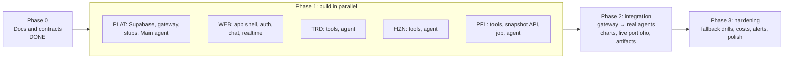

# 09. Workstreams: parallel sessions

The build is split across **five Claude Code sessions** that work in parallel on the same repo and the same n8n instance. Each session owns a clear slice. Contracts (APIs, schema, agent I/O, names) are already fixed, so sessions can build against them without waiting for each other.

> Prefer exactly four sessions, one per product chat? Merge **Platform & Main** and **Web App** into one "Main" session. It does the Platform work first (Phase 1 days 1–2), then the web app.

## 1. Sessions

| Code | Session | Mission | Primary outputs |
|---|---|---|---|
| PLAT | **Platform & Main** | Database, gateway, guardrail, error handling, Main agent; keeps the contracts | Supabase schema live, `Aura · API · Chat Message`, `Aura · System · *`, `Aura · Agent · Main`, `Aura · Tool · Market Overview`, agent stubs |
| WEB | **Web App** | The whole Next.js app on Vercel, implementing the design system | `apps/web`, production URL |
| TRD | **Trading** | Short-term market tools and the Trading agent | `Aura · Tool · Crypto Chart / Order Book / Trade Flow / Derivatives / Market Chart / Crypto Sentiment`, `Aura · Agent · Trading` |
| HZN | **Horizon 2030** | Long-term research tools and the Horizon agent | `Aura · Tool · Company Profile / Financials / Insider Activity / Filings / Price History / Crypto Fundamentals`, `Aura · Agent · Horizon` |
| PFL | **Portfolio & Macro** | Portfolio valuation, health score, macro tools, daily automation and the Portfolio agent | `Aura · Tool · Quotes / Portfolio / Macro Snapshot / Macro Calendar / Portfolio History`, `Aura · API · Portfolio Snapshot`, `Aura · Job · Daily Portfolio Review`, `Aura · Agent · Portfolio` |

## 2. Ownership

| Path or resource | Owner | Others may |
|---|---|---|
| `CLAUDE.md`, `docs/00`–`02`, `docs/07`, `docs/08`, `docs/10`, `prompts/` | PLAT (maintainer) | Propose changes in a PR |
| `docs/05-api-contracts.md`, `docs/06-database.md`, `supabase/**` | PLAT | Change only through the contract-change process (§4) |
| `docs/03-design-system.md`, `apps/web/**` | WEB | Request changes in STATUS |
| `docs/04-data-sources.md` | Shared | Fix endpoint facts in a `docs:` commit |
| `agents/_shared/**`, `agents/main/**`, `n8n/scripts/**` | PLAT | — |
| `agents/trading/**` | TRD | — |
| `agents/horizon/**` | HZN | — |
| `agents/portfolio/**` | PFL | — |
| `n8n/workflows/<file>` | Owner of that workflow ([07-n8n-playbook.md §5](07-n8n-playbook.md#5-workflow-catalog)) | — |
| `n8n/registry.md` | Shared | Each session edits **only its own rows** |
| `docs/STATUS.md` | Shared | Each session edits **only its own section** |
| `docs/CHANGELOG.md` | Shared | Append only |
| n8n workflows | Owner per catalog | Never edit another session's workflow |

## 3. Phases and dependencies



| Milestone | Session | Definition |
|---|---|---|
| P1-a | PLAT + owner | Supabase project live with the migration applied; friend user created; n8n credentials present |
| P1-b | PLAT | Gateway published; a POST produces a stub assistant message in the DB (the "echo path") |
| W1 | WEB | Deployed app: login, sidebar, chats CRUD, send, and a Realtime reply from the stub agent |
| T1 / H1 / F1 | TRD / HZN / PFL | All tools published and tested with live data |
| T2 / H2 / F2 | TRD / HZN / PFL | Agent workflow (stub updated in place) passes the shared and agent eval cases |
| F3 | PFL | Snapshot API and daily job published; one daily run done |
| I1 | PLAT + WEB | All five journeys from [00-overview.md §5](00-overview.md#5-key-user-journeys-mvp-acceptance-scenarios) pass on the production URL |

| Dependency | Provider | Workaround until it's ready |
|---|---|---|
| Supabase project and migration | Owner + PLAT | WEB uses fixture data and a dev-only mock; agent sessions test tools without the DB |
| n8n credentials (keys) | Owner | Start with keyless providers (Binance, Bybit, SEC, DefiLlama, alternative.me); list missing keys under "Needs owner" |
| Agent stub workflows | PLAT | Agent sessions create the workflow under the exact catalog name; PLAT adopts its ID |
| Gateway live | PLAT | WEB has a dev-only mock in `/api/chat/send` that inserts a fake assistant reply (`NODE_ENV=development` only) |
| Snapshot API | PFL | WEB renders the Live Portfolio panel from a fixture JSON matching `PortfolioSnapshot` |

## 4. Contract changes

The contracts are `docs/05-api-contracts.md`, `docs/06-database.md` with the migrations, the agent I/O in `docs/08-agents.md`, and the names in `n8n/registry.md`.

1. Any session can propose a change. PLAT reviews and merges.
2. Make the change in a dedicated PR titled `contract: <summary>`. It must:
   - update every affected document;
   - add a **new** migration for schema changes (never edit an applied one);
   - append an entry to `docs/CHANGELOG.md` (date, change, impact, who must act);
   - stay backward compatible where possible.
3. Adding an optional JSON field or a nullable column is allowed with a CHANGELOG entry and no version bump. Renaming or removing something needs a new versioned path (`/v2/`) or a migration plan.
4. After the merge, every session merges `main` into its branch (`git fetch origin main && git merge origin/main`) before continuing.

## 5. Rules for every session

1. Read `CLAUDE.md` and your reading list ([docs/README.md](README.md#reading-list-per-session)) before writing any code.
2. Stay inside your ownership. If you need something from another session, add it under "Requests" in your STATUS section and tell the owner.
3. n8n: find-or-create by exact name, read the SDK reference first, commit the source, update the registry, publish ([07-n8n-playbook.md](07-n8n-playbook.md)).
4. Never commit secrets. If you need a key, ask the owner to create the credential or env var.
5. Work on your own branch. Open a PR to `main` per milestone. Merge `main` into your branch often.
6. Definition of done for a deliverable:
   - **built**;
   - **tested**, with evidence in STATUS: eval results, execution IDs or screenshots;
   - **live**: published in n8n or deployed on Vercel;
   - **documented**: registry, STATUS, any doc fixes.

## 6. Kickoff prompts

Start a new Claude Code session on this repository for each session. Use a branch that contains these docs: `main` after the docs PR is merged, or `claude/magical-ride-09t5ce`. Paste the matching prompt as the first message.

### PLAT: Platform & Main

```text
You are the "Platform & Main" session (code PLAT) of the Aura Invest AI project in this repository.

1. Read CLAUDE.md, then docs/README.md and the PLAT reading list in it. Read everything listed before you build.
2. Your mission: make the platform run end to end and ship the Main agent.
   - With the owner, run the setup checklist in docs/10-operations.md §2 (Supabase project, migration, auth settings, friend user, n8n credentials). Give the owner exact click-by-click steps for anything only they can do.
   - In n8n, following docs/07-n8n-playbook.md:
     - create the "Aura Invest AI" folder and the tags;
     - create stub workflows for Aura · Agent · Trading, Horizon and Portfolio (find-or-create by exact name);
     - build Aura · System · Guardrail, Aura · System · Error Handler and the gateway Aura · API · Chat Message (spec in docs/07 §8);
     - build Aura · Tool · Market Overview and Aura · Agent · Main (agents/main/SPEC.md).
   - Commit every workflow's SDK source under n8n/workflows/, run node n8n/scripts/embed-prompts.mjs, and keep n8n/registry.md and docs/STATUS.md (PLAT section) current.
3. Milestones: P1-a, P1-b, then the Main agent passing evals S1–S6 and M1–M10. In Phase 2, wire the gateway to the real agents as the other sessions finish, and run the five journeys in docs/00-overview.md §5 with the Web App session.
4. You own: docs/05, docs/06, supabase/**, agents/_shared/**, agents/main/**, n8n/scripts/**, and the PLAT workflows. You are the gatekeeper for contract changes (docs/09 §4).
Start by summarizing your plan in at most 10 bullets, list what you need from the owner, then execute.
```

### WEB: Web App

```text
You are the "Web App" session (code WEB) of the Aura Invest AI project in this repository.

1. Read CLAUDE.md, then docs/README.md and the WEB reading list in it, plus apps/web/README.md.
2. Your mission: build and deploy the complete Next.js app in apps/web, exactly following docs/03-design-system.md and the contracts in docs/05-api-contracts.md and docs/06-database.md.
   - Stack: Next.js (App Router, TypeScript), Tailwind CSS v4 with the design tokens, shadcn/ui primitives restyled flat, lucide-react, @supabase/supabase-js + @supabase/ssr, lightweight-charts, react-markdown + remark-gfm.
   - Pages: /login, /c/[chatId], /artifacts, /artifacts/[id], /settings. Sidebar with the four workspaces, + buttons, the pinned "My Live Portfolio", and the profile panel.
   - API routes: /api/chat/send, /api/market/overview, /api/market/candles, /api/portfolio/snapshot (market routes call providers directly with preferredRegion 'fra1').
   - Realtime replies with fallback polling, thinking/error/retry states, CandleChartCard, Live Portfolio panel with holdings editor, Artifacts.
   - Deploy on Vercel (root directory apps/web). Ask the owner to set the env vars from .env.example.
3. Milestones: W1 (deployed chat loop with the stub agent), then all UI for journeys 1–5. Use fixture data until the gateway and snapshot API are live.
4. You own apps/web/** and docs/03-design-system.md. Never edit n8n workflows or the schema. Request changes in docs/STATUS.md.
Start by summarizing your plan in at most 10 bullets, then execute. Run typecheck and lint before every PR.
```

### TRD: Trading

```text
You are the "Trading" session (code TRD) of the Aura Invest AI project in this repository.

1. Read CLAUDE.md, then docs/README.md and the TRD reading list in it. agents/trading/SPEC.md is your main spec.
2. Your mission: build the six Trading tool workflows exactly as specified (Crypto Chart, Order Book, Trade Flow, Derivatives, Market Chart, Crypto Sentiment), with provider fallbacks and caching from docs/04-data-sources.md. Then build Aura · Agent · Trading with the system prompt assembled from agents/_shared/* + agents/trading/system-prompt.md (embed with node n8n/scripts/embed-prompts.mjs).
   - Follow docs/07-n8n-playbook.md: SDK reference first, find-or-create by exact name. If PLAT already created the agent stub, update it in place. Commit the SDK source under n8n/workflows/, publish, and update your rows in n8n/registry.md.
3. Milestones: T1 (tools live and tested), T2 (agent passes S1–S6 and T1–T12). Record results in your STATUS section.
4. You own agents/trading/** and the Trading workflows only. Do not modify the gateway, the schema or other sessions' workflows. Put requests in docs/STATUS.md.
Start by summarizing your plan in at most 10 bullets, then execute.
```

### HZN: Horizon 2030

```text
You are the "Horizon 2030" session (code HZN) of the Aura Invest AI project in this repository.

1. Read CLAUDE.md, then docs/README.md and the HZN reading list in it. agents/horizon/SPEC.md is your main spec.
2. Your mission: build the six Horizon tool workflows (Company Profile, Financials from SEC XBRL with the concept fallbacks, Insider Activity, Filings, Price History, Crypto Fundamentals), with caching from docs/04-data-sources.md. Then build Aura · Agent · Horizon with the system prompt assembled from agents/_shared/* + agents/horizon/system-prompt.md, including artifact output for theses.
   - Follow docs/07-n8n-playbook.md: SDK reference first, find-or-create by exact name. If PLAT already created the agent stub, update it in place. Commit the SDK source, publish, and update your rows in n8n/registry.md.
3. Milestones: H1 (tools live; SEC fallbacks verified on NVDA, AAPL, MSFT, TSLA and one foreign filer), H2 (agent passes S1–S6 and H1–H12).
4. You own agents/horizon/** and the Horizon workflows only. Put requests in docs/STATUS.md.
Start by summarizing your plan in at most 10 bullets, then execute.
```

### PFL: Portfolio & Macro

```text
You are the "Portfolio & Macro" session (code PFL) of the Aura Invest AI project in this repository.

1. Read CLAUDE.md, then docs/README.md and the PFL reading list in it. agents/portfolio/SPEC.md is your main spec.
2. Your mission:
   - build the tools Quotes, Portfolio (with the deterministic health score; it must reproduce the fixture in SPEC §5 exactly), Macro Snapshot (FRED), Macro Calendar (FRED releases plus the FOMC constant) and Portfolio History;
   - build the webhook Aura · API · Portfolio Snapshot and the scheduled Aura · Job · Daily Portfolio Review;
   - build Aura · Agent · Portfolio with the system prompt from agents/_shared/* + agents/portfolio/system-prompt.md, supporting the modes chat, portfolio_review and daily_review.
   - user_id is always bound from AgentInput, never chosen by the model.
   - Follow docs/07-n8n-playbook.md. If PLAT already created the agent stub, update it in place. Commit the SDK source, publish, and update your rows in n8n/registry.md.
3. Milestones: F1 (tools live), F2 (agent passes S1–S6 and P1–P10), F3 (snapshot API and daily job live; one manual daily run done).
4. You own agents/portfolio/** and the Portfolio workflows only. You read and write Supabase tables only as described in docs/06-database.md. Put requests in docs/STATUS.md.
Start by summarizing your plan in at most 10 bullets, then execute.
```

## 7. Status reporting

Every session keeps its section of [STATUS.md](STATUS.md) current with these fields:

- status;
- done;
- in progress;
- next;
- needs owner;
- requests to other sessions;
- test and eval evidence.

Update it at the end of every work block, even if nothing is finished.
